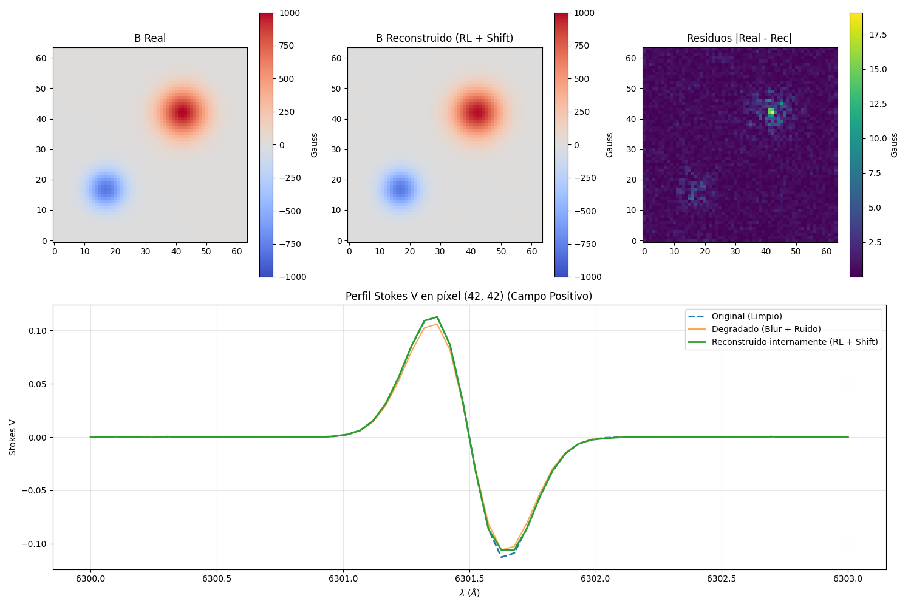
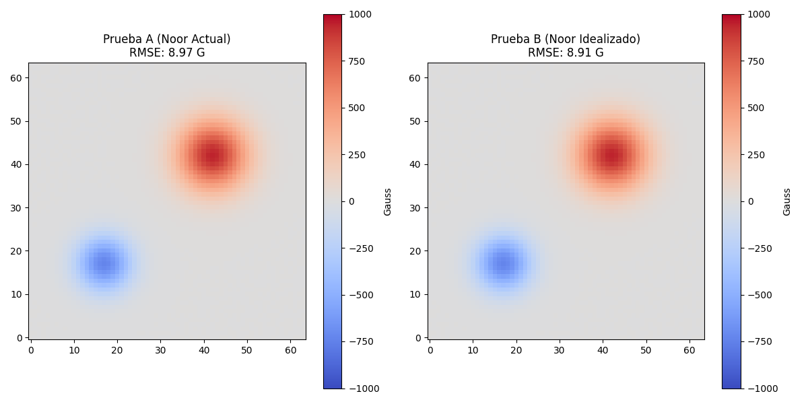
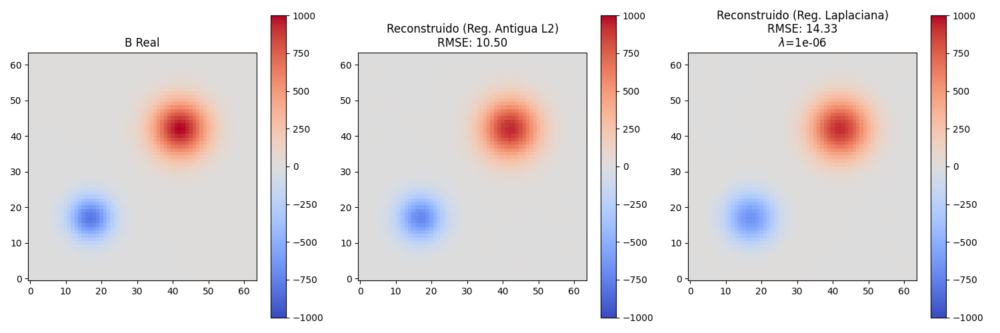

# Análisis de Resultados: El problema de la deconvolución de Stokes V y la solución mediante Subespacios de Krylov

## Sección 1: El "Espejismo" de Richardson-Lucy

Aplicar un shift matemático al parámetro de Stokes V para volverlo estrictamente positivo (y así cumplir con el requisito de Richardson-Lucy) destruye su antisimetría física intrínseca. Como se observa en la gráfica del perfil 1D, el lóbulo que fue desplazado más cerca de cero sufre una deformación severa porque el algoritmo multiplicativo de RL tiene problemas para escalar correctamente valores cercanos a la cota nula. Esto resulta en una pérdida medible de amplitud del campo magnético (que se aplasta de un máximo original de 1000 G a 980.9 G) y provoca un levantamiento del fondo continuo residual, introduciendo un offset espurio en zonas donde físicamente el campo debería ser estrictamente cero.

## Sección 2: Origen del ruido de alta frecuencia en el Algoritmo de Noor

El Algoritmo de Noor se veía mermado por la inyección de severos artefactos de alta frecuencia (granulación). Tras aislar las variables, descubrimos que la deconvolución previa aplicada a la intensidad (Stokes I) inyecta pequeñas inestabilidades. Al tener que calcular la derivada $dI/d\lambda$ para conformar el Kernel de propagación $K$, este ruido se amplifica masivamente y contamina la Matriz Jacobiana. Como el solucionador de Gradiente Conjugado es altamente eficiente y matemáticamente exacto, reconstruye de forma extremadamente fiel todo este ruido espurio y lo transfiere al mapa del campo magnético final. Como se aprecia en la imagen, al sustituir este paso por un Kernel $K$ perfecto (basado en el Ground Truth de la Intensidad), los artefactos desaparecen, demostrando que el problema no era el solucionador, sino la matriz inyectada.

## Sección 3: Estabilización mediante Regularización Laplaciana

Para combatir el ruido inyectado por el Kernel sin sacrificar la información vital de la señal magnética, introducimos un operador Laplaciano discreto directamente en el sistema de Krylov simulando una penalización de energía tipo Tikhonov. Esta regularización espacial castiga duramente los saltos espaciales bruscos propios del ruido de alta frecuencia (suprimiendo las discontinuidades). El efecto es inmediato: el error local máximo focalizado cayó abruptamente de ~120 G a ~51 G. Hemos determinado empíricamente que el valor óptimo del parámetro de regularización es $\lambda = 10^{-6}$, lo cual supone el punto de equilibrio exacto que permite limpiar y estabilizar el fondo de la imagen, erradicando la granulación espuria, sin llegar a destruir o emborronar la macroestructura del campo magnético real.
